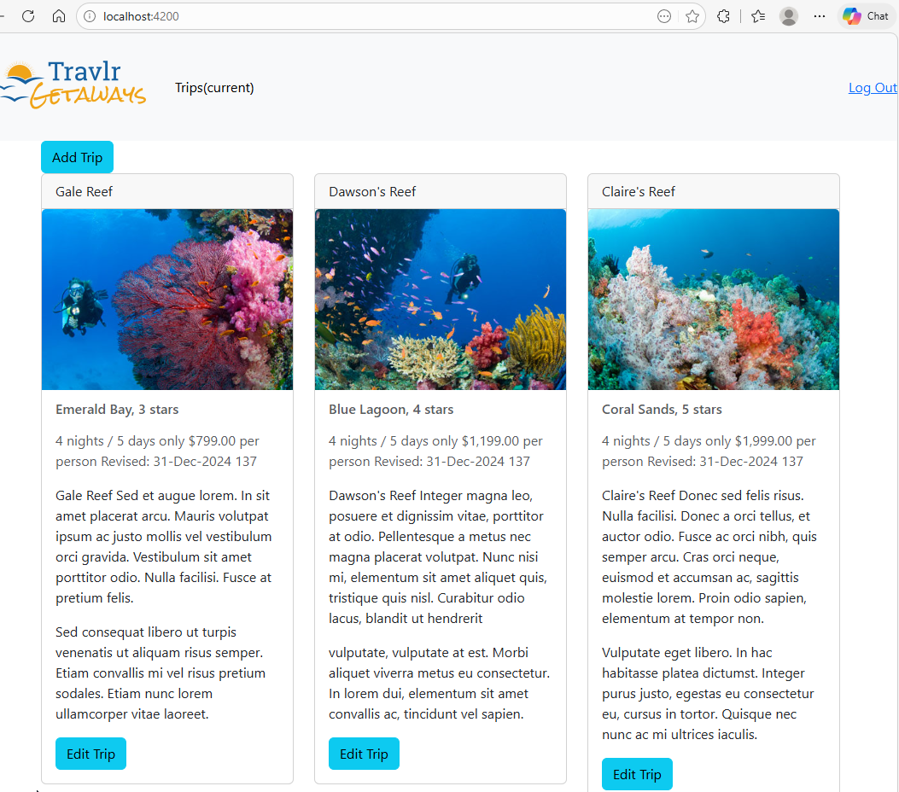
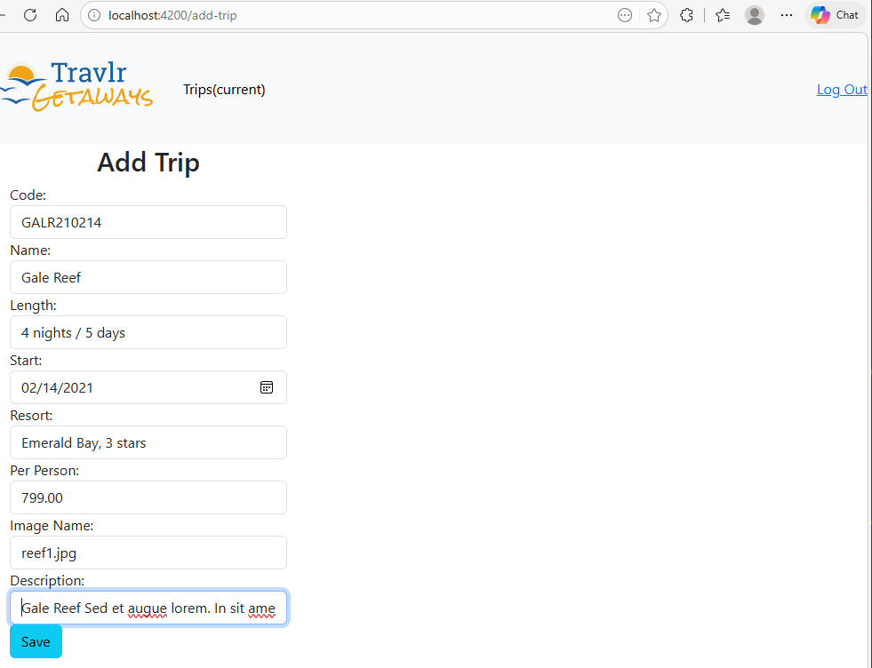
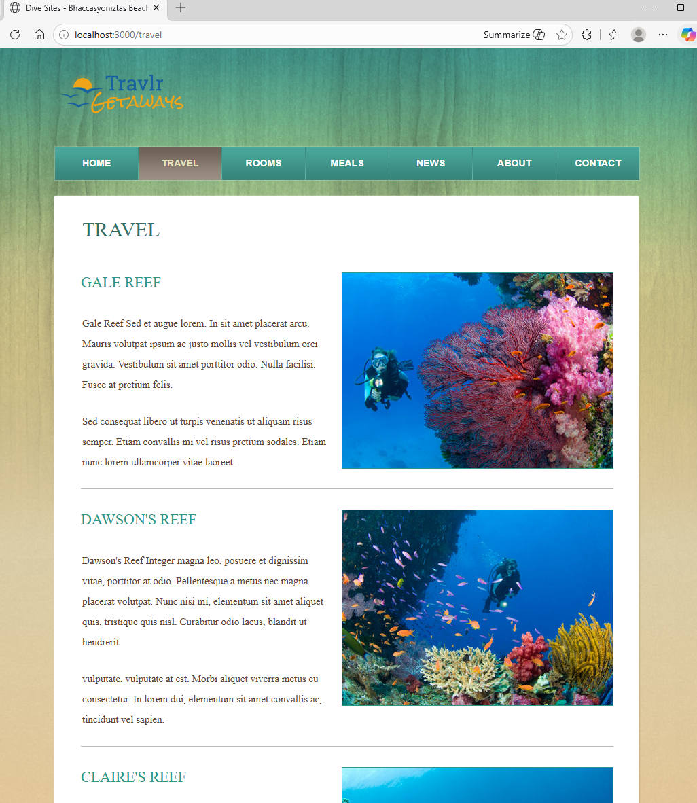
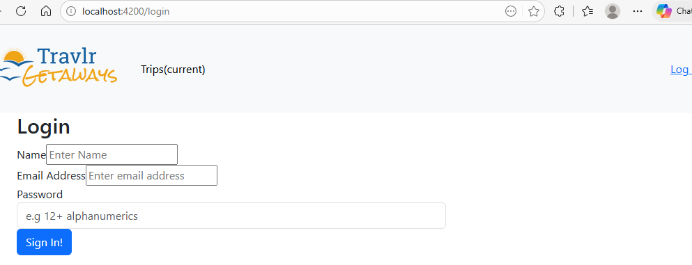

# Travlr - Full-Stack Booking Application
A full-stack travel booking application built with the MEAN architecture (MongoDB, Express, Angular, Node.js).
The project includes both a public-facing site for browsing trips and an authenticated admin interface
for managing travel data.

Originally developed as part of coursework, I've refactored and extended the application to 
improve usability and setup as a portfolio presentation. Key improvements include fixing the authentication layer
and adding a seed script to easily load demo data.

## Screenshots
**Admin Dashboard**

**Add / Edit Trip**

**Public Travel Page**

**Admin Login Page**

## Features
- Browse available trips (public site)
- Admin dashboard for managing trips
- Create, update, and maintain trip data
- JWT-based authentication for protected routes
- Consistent data integrity with MongoDB
- RESTful API connecting the frontend and backend

## Architecture
- The Angular Admin side of the application authenticates users to manage trip data
- The Express API handles authentication and database operations
- The MongoDB database stores users and trip data across sessions
- The public facing site renders trip data using the handlebars format
This setup was chosen to become familiarized with this tech-stack and demonstrate 
real-world admin-controlled content management with a client-side view.

## Setup
**Clone repository using git and move to the project folder**
- git clone https://github.com/billycook71/cs465-fullstack.git
- cd ../cs465-fullstack

**Install dependencies**
- npm install
- cd app_admin
- npm install
- cd ..

**configure environment variables**
- create a .env file in the root directory (not included due to git.ignore)
- example: JWT_SECRET=supersecretkey123

**Ensure MongoDB is installed & running**

**Seed the databse (seeds some sample trips and an admin login)**
- npm run seed
- npm run seed -- --reset (also included if you need to scrub some existing data to run, just removes existing trips * admin logins)

**Run the application**
- npm start
- cd app_admin
- npm start
(this starts the backend and frontend, both need to be running)

**Accessing the app**
- In your browser paste the client-side: http://localhost:3000
- In your browser paste the admin-side: http://localhost:4200

## Future Improvmeents
- Improve API validation and error handling
- Enhance Admin UI/UX
